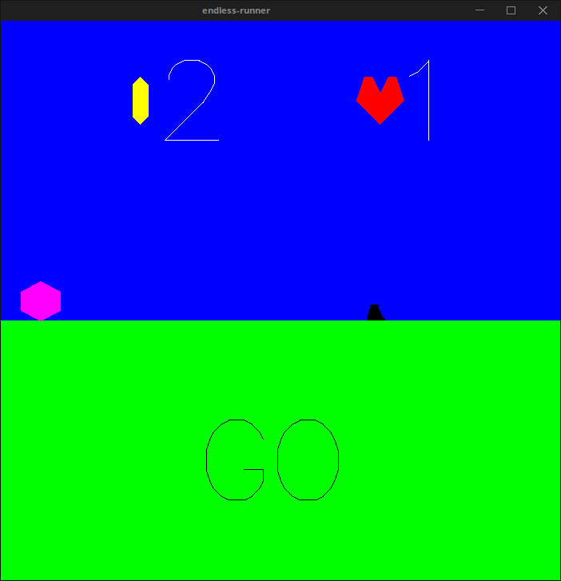

# endless-runner
 
[](https://travis-ci.org/cmc-haskell-2016/endless-runner)

## Установка и запуск

Для установки клонируйте репозиторий и соберите проект с помощью `stack`:

```
git clone https://github.com/cmc-haskell-2016/endless-runner.git
cd endless-runner
stack setup
stack build
```

После установки запуск осуществляется командой `stack exec`:

```
stack exec endless-runner
```

Во время разработки инициировать повторную сборку проекта с последующим запуском рекомендуется
следующей командой:

```
stack build && stack exec endless-runner
...

```
Жми стрелку вверх, чтоб прыгнул.
R - чтоб начать заново
